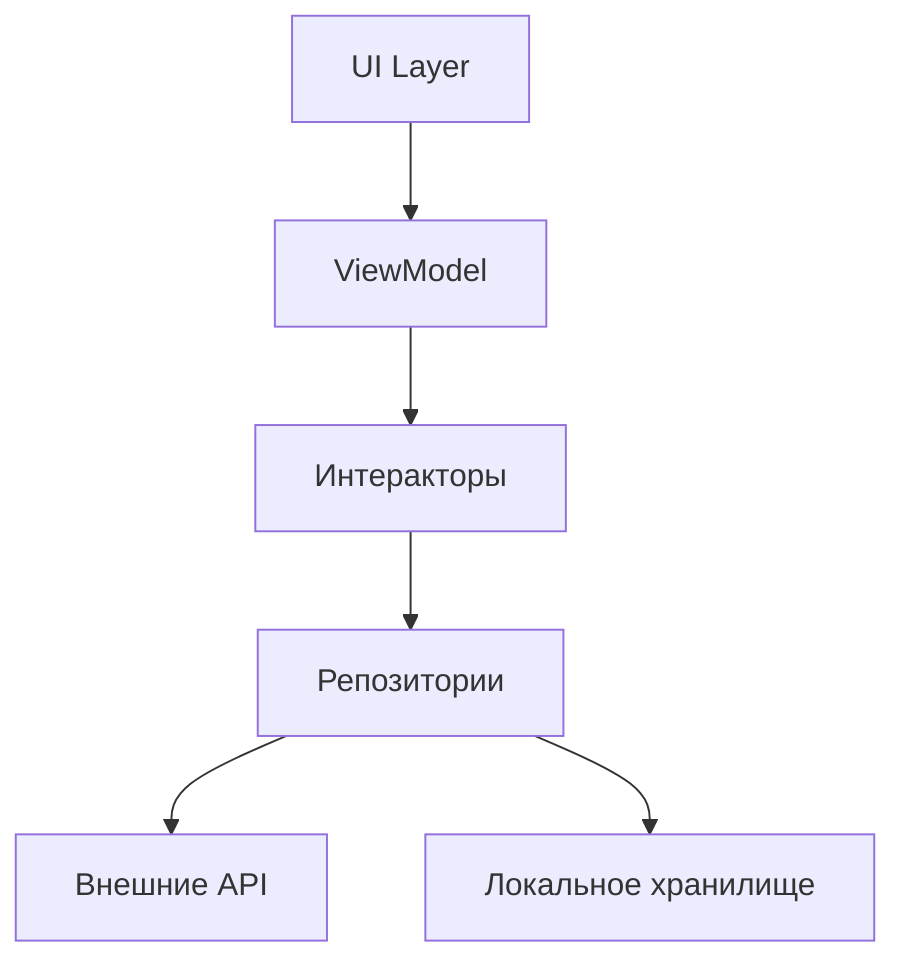
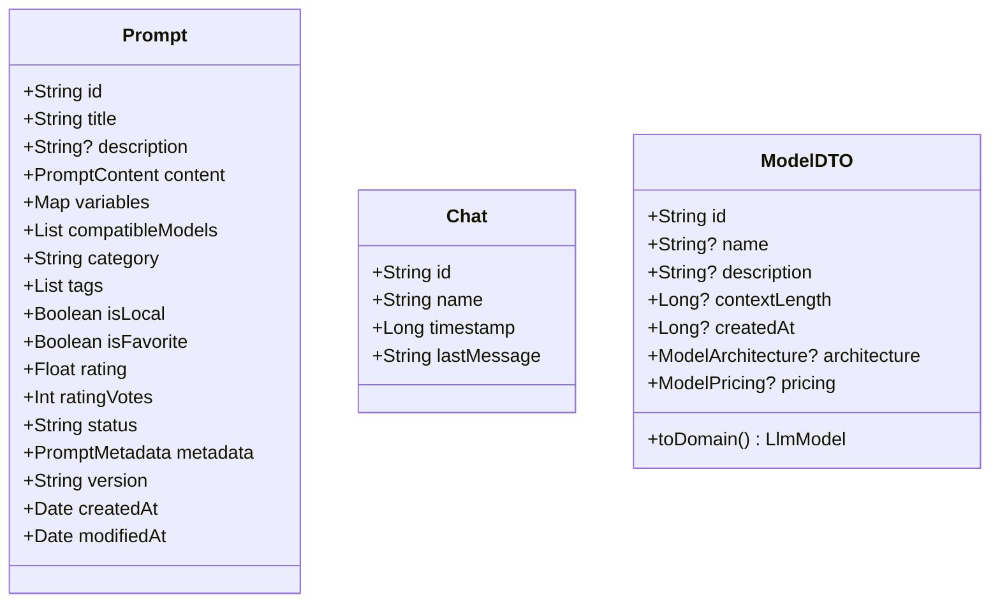
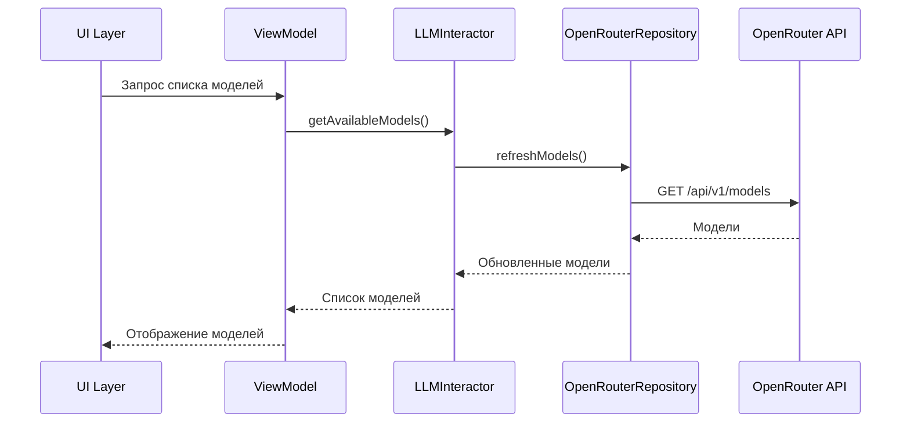
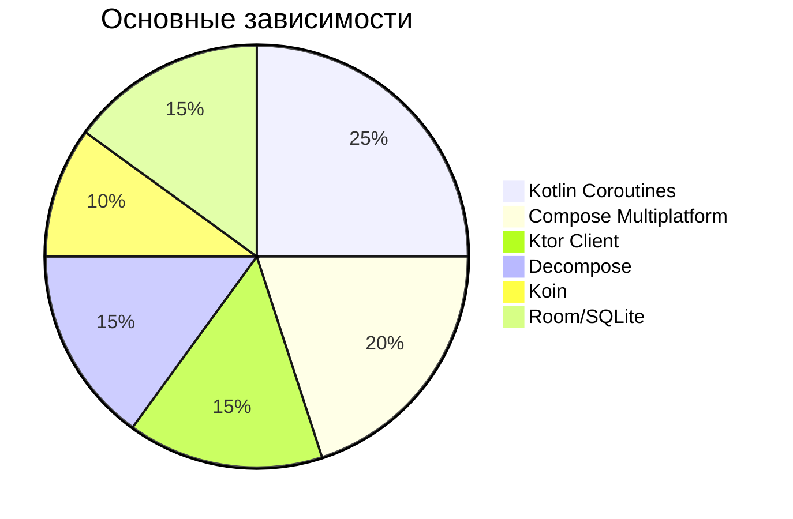
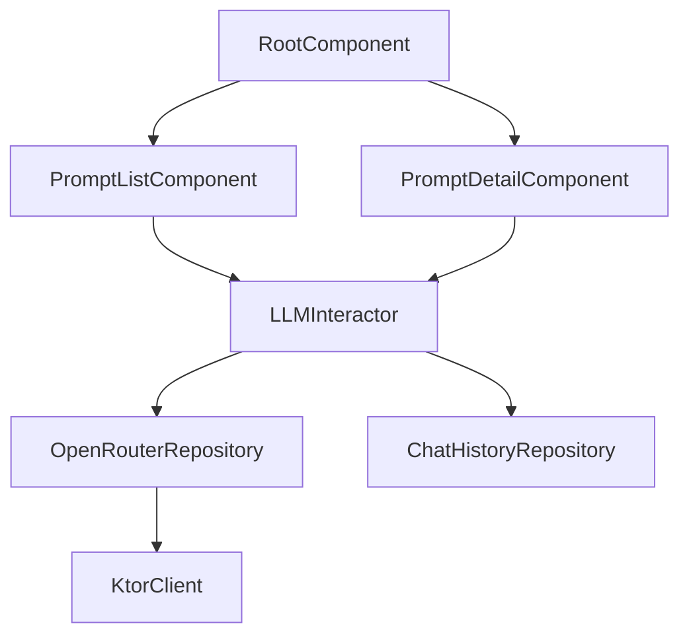

# Анализ проекта AiPromptsKMP

## Технологический стек
- **Язык**: Kotlin Multiplatform (Android, Desktop)
- **UI**: Compose Multiplatform
- **Навигация**: Decompose
- **DI**: Koin + кастомный DI-контейнер
- **Сеть**: Ktor + OpenRouter API
- **Локальное хранилище**: Room/SQLite
- **Асинхронность**: Kotlin Coroutines

## Архитектура

### Ключевые компоненты
1. **RootComponent** - корневой компонент навигации
2. **LLMInteractor** - ядро бизнес-логики
3. **OpenRouterRepository** - интеграция с LLM API
4. **PromptListComponent/PromptDetailComponent** - компоненты экранов

## Модели данных

## Workflow бизнес-логики

## Зависимости

### Версии зависимостей
- **Kotlin**: 2.2.0
- **Compose**: 1.8.2
- **Ktor**: 3.1.3 (BOM)
- **Decompose**: 3.4.0-alpha03
- **Room**: 2.7.2
- **Koin**: 4.0.4

## Полная схема компонентов

## Особенности реализации
1. **Кроссплатформенный DI**:
   - Общие зависимости в `commonMain`
   - Платформенные реализации через expect/actual
2. **Состояние навигации**:
   - Сохранение стека через ScreenConfig.serializer()
   - Чистая архитектура компонентов
3. **Модели данных**:
   - Сериализация через kotlinx.serialization
   - Поддержка мультиязычных промптов
   - Автоматическое маппинга DTO через ModelDTO.toDomain()

## Рекомендации
1. Добавить кэширование моделей LLM
2. Реализовать IPromptSynchronizer
3. Внедрить centralized error handling
4. Добавить модульное тестирование ключевых компонентов
5. Внедрить Data Class Validation для моделей