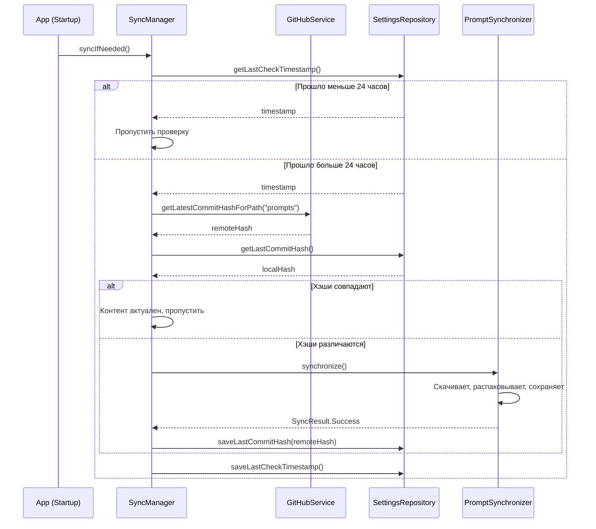
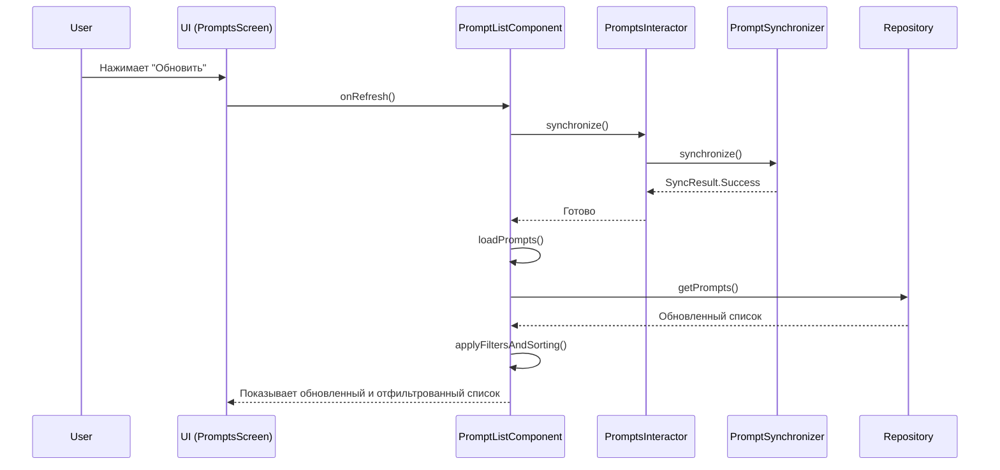

# Анализ проекта AiPrompsKMP (Обновлено)

## 1. Общее описание

Проект **AiPrompsKMP** представляет собой кросс-платформенное приложение для управления и использования AI-промптов, разработанное на базе **Kotlin Multiplatform (KMP)**. Приложение нацелено на две платформы: **Android** и **Desktop (JVM)**.

Архитектура проекта следует современным практикам разработки KMP-приложений, используя стек технологий, который обеспечивает максимальное переиспользование кода, хорошую тестируемость и масштабируемость.

## 2. Архитектура

Проект построен на основе **многослойной архитектуры**, близкой к **Clean Architecture**. Это обеспечивает четкое разделение ответственности между компонентами системы.

-   **`commonMain`**: Ядро приложения. Содержит всю общую бизнес-логику, включая UI (написанный на Jetpack/JetBrains Compose), управление состоянием, навигацию, репозитории, интеракторы и модели данных.
-   **`androidMain`**: Платформенный модуль для Android. Содержит точку входа в приложение (`MainActivity`, `AiPromptsAndroidApplication`), а также `actual`-реализации `expect`-деклараций из `commonMain`.
-   **`desktopMain`**: Платформенный модуль для Desktop. Аналогично `androidMain`, содержит точку входа (`main.kt`) и платформенные реализации для JVM.

## 3. Ключевые технологии

| Технология | Назначение |
| :--- | :--- |
| **Kotlin Multiplatform** | Основа для создания общего кода для Android и Desktop. |
| **Jetpack/JetBrains Compose** | Декларативный UI-фреймворк для создания общего пользовательского интерфейса. |
| **Decompose** | Библиотека для навигации и управления жизненным циклом компонентов в KMP. |
| **Koin** | Фреймворк для внедрения зависимостей (DI). |
| **Kotlinx Coroutines** | Основа для выполнения асинхронных операций. |
| **Ktor Client** | HTTP-клиент для выполнения сетевых запросов. |
| **Kotlinx Serialization** | Библиотека для сериализации/десериализации JSON. |
| **Room** | ORM для работы с локальной базой данных SQLite в KMP. |
| **Okio** | Производительная библиотека для I/O операций, используется для распаковки архивов. |
| **Multiplatform-Settings** | Библиотека для хранения простых key-value данных (настроек). |
| **Ollama Client** | Интеграция с локальными языковыми моделями через Ollama (только Desktop). |

## 4. Анализ слоев

### 4.1. Слой представления (Presentation Layer)

-   **UI:** Полностью написан на **Compose Material 3**.
-   **Архитектура UI:** Применяется **MVI-подобный подход**.
    -   **Component (Decompose):** `PromptListComponent` выступает в роли ViewModel, управляя сложным состоянием экрана (фильтры, сортировка, поиск) и обрабатывая многочисленные действия пользователя.
    -   **State (`StateFlow`):** Компонент предоставляет `PromptsListState` для UI, обеспечивая однонаправленный поток данных.
-   **Навигация:** Управляется **Decompose**.

### 4.2. Слой бизнес-логики (Business Logic Layer)

-   **Интеракторы (Use Cases):** Логика инкапсулирована в интеракторах (`IPromptsInteractor`, `ILLMInteractor`).
-   **`SyncManager` (Новое):** Появился новый ключевой компонент `SyncManager`, который отвечает за **стратегию фоновой синхронизации**. Он решает, *когда* нужно проверять обновления, используя эффективный механизм сравнения хэшей коммитов, что значительно снижает сетевую нагрузку.
-   **`PromptSynchronizer` (Улучшено):** Этот класс был переработан. Теперь он отвечает только за **процесс** синхронизации (скачивание, распаковка с помощью Okio, сохранение), делегируя принятие решений `SyncManager`. Также он теперь корректно обрабатывает промпты, удаленные из удаленного репозитория.

### 4.3. Слой данных (Data Layer)

-   **Репозитории:** Абстрагируют источники данных.
-   **Сеть (Ktor):**
    -   `GitHubService`: Скачивает zip-архив и получает хэш последнего коммита.
    -   `OpenRouterService`: Взаимодействует с API OpenRouter.
-   **База данных (Room):**
    -   `PromptDao` предоставляет мощный API для CRUD-операций и сложной фильтрации.

## 5. Ключевые сценарии взаимодействия

### Сценарий 1: Интеллектуальная фоновая синхронизация (Новая архитектура)

Этот сценарий показывает, как приложение эффективно проверяет наличие обновлений в фоне.

### Сценарий 2: Ручное обновление и фильтрация списка

## 6. Недавние архитектурные улучшения

1.  **Интеллектуальная синхронизация:** Внедрение `SyncManager` с проверкой по хэшу коммита — это главное улучшение. Оно превращает наивную синхронизацию в эффективный и экономичный механизм.
2.  **Четкое разделение ответственности:** Обязанности по синхронизации теперь четко разделены между `SyncManager` (стратегия), `PromptsInteractor` (API для UI) и `PromptSynchronizer` (исполнитель).
3.  **Обработка удалений:** Синхронизация теперь корректно обрабатывает промпты, удаленные из репозитория, поддерживая консистентность локальной базы данных.
4.  **Мощный UI:** `PromptListComponent` был значительно расширен для поддержки сложной фильтрации, сортировки и поиска, обеспечивая богатый пользовательский опыт.
5.  **Использование Okio:** Переход на `Okio` для работы с zip-архивами — это технически грамотное решение, повышающее надежность и производительность I/O операций.

## 7. Потенциальные улучшения

1.  **Нормализация тегов:** Теги в `PromptEntity` по-прежнему хранятся в виде единой строки. Для более сложных запросов (например, "найти промпты с тегом A и тегом B") может потребоваться нормализация схемы с вынесением тегов в отдельную таблицу.
2.  **Оптимизация фильтрации:** Текущая фильтрация происходит на стороне клиента в `applyFiltersAndSorting`. При очень большом количестве промптов это может стать неэффективным. В будущем можно рассмотреть перенос логики фильтрации на уровень базы данных, модифицировав запросы в `PromptDao`.

## 8. Заключение

Проект **AiPrompsKMP** демонстрирует значительный рост и зрелость архитектуры. Последние изменения, особенно введение интеллектуального `SyncManager`, показывают глубокое понимание проблем реального мира и стремление к созданию эффективного и надежного приложения. Архитектура остается чистой, масштабируемой и легко поддерживаемой. Выбор технологий актуален и соответствует лучшим практикам индустрии.