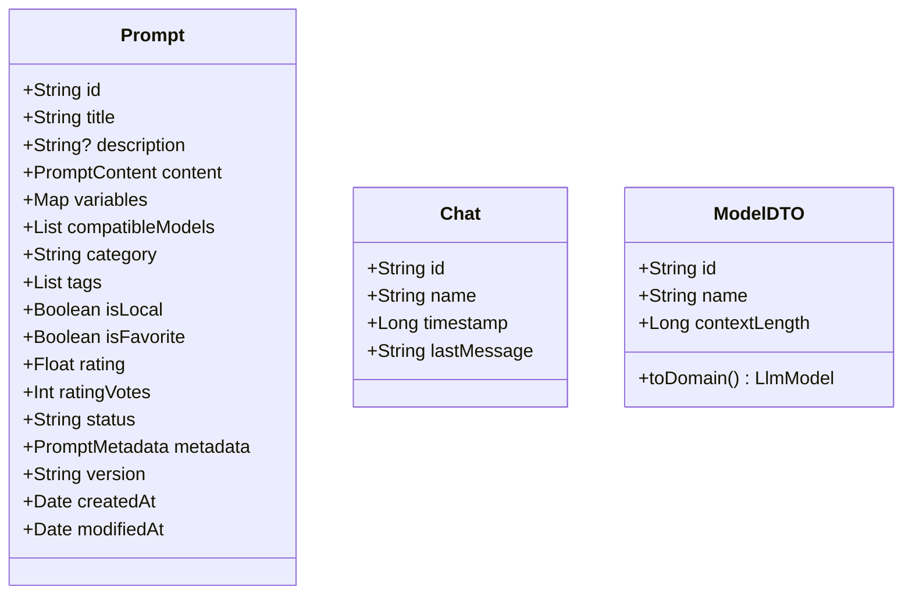
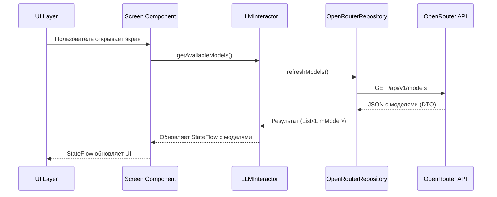
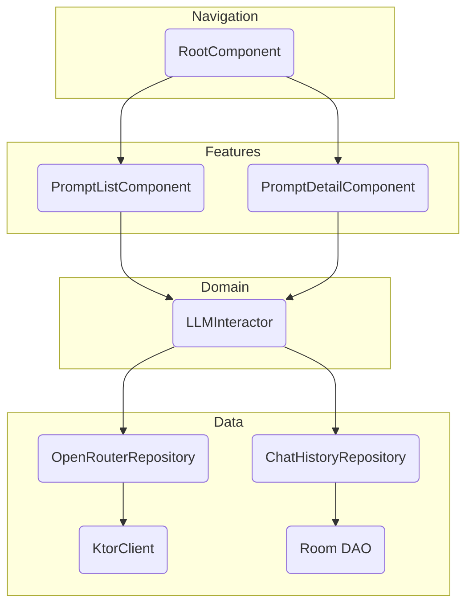

# Анализ проекта: AiPromptsKMP

Этот документ содержит технический анализ кросс-платформенного приложения `AiPromptsKMP`, предназначенного для просмотра и управления промптами.

## 1. Технологический стек и архитектура

Проект построен на современном стеке Kotlin Multiplatform, что обеспечивает единую кодовую базу для бизнес-логики и UI на всех целевых платформах.

### Технологический стек
- **Язык**: `Kotlin`
- **Платформы**: `KMP` (Android, Desktop/JVM)
- **UI**: `Compose Multiplatform`
- **Асинхронность**: `Kotlin Coroutines` & `Flow`
- **Навигация**: `Decompose`
- **Dependency Injection**: `Koin`
- **Сеть**: `Ktor Client` (взаимодействие с OpenRouter API)
- **База данных**: `Room KMP` / `SQLite`

### Архитектура
Приложение следует принципам чистой архитектуры (Clean Architecture), разделяя логику на независимые слои (UI, бизнес-логика, данные). Это обеспечивает высокую тестируемость, масштабируемость и поддерживаемость проекта.

```mermaid
graph TD
    subgraph UI Layer
        A[Compose UI] --> B[Component/ViewModel];
    end
    subgraph Domain Layer
        B --> C[Интеракторы];
    end
    subgraph Data Layer
        C --> D[Репозитории];
        D --> E[API (Ktor)];
        D --> F[БД (Room)];
    end
```

### Ключевые компоненты
- **`RootComponent`**: Корневой компонент Decompose, управляющий навигационным стеком и жизненным циклом дочерних экранов.
- **`PromptListComponent` / `PromptDetailComponent`**: Компоненты экранов, аналог ViewModel в KMP, отвечающие за состояние UI и обработку действий пользователя.
- **`LLMInteractor`**: Ядро бизнес-логики, координирующее взаимодействие между репозиториями и UI.
- **`OpenRouterRepository`**: Абстракция для работы с внешним LLM API, инкапсулирует логику сетевых запросов.

## 2. Модели данных

Основные сущности приложения спроектированы для эффективного хранения и передачи данных между слоями.



## 3. Workflow бизнес-логики

Процессы в приложении организованы через однонаправленный поток данных. Ниже представлен пример workflow для получения списка доступных LLM-моделей.



## 4. Управление зависимостями

Проект использует современные версии ключевых библиотек, что обеспечивает доступ к последним возможностям и улучшениям производительности.


### Ключевые версии
- **Kotlin**: `2.2.0`
- **Compose Plugin**: `1.8.2`
- **Ktor**: `3.1.3`
- **Decompose**: `3.3.0`
- **Room**: `2.7.2`
- **Koin**: `4.0.4`
- **KSP**: `2.2.0-2.0.2`
- **Coroutines**: `1.10.2`
- **Android compileSdk**: `35`

> **Примечание**: Использование актуальных версий требует строгого соблюдения [таблицы совместимости](https://github.com/JetBrains/compose-jb/blob/master/VERSIONING.md#kotlin-compatibility) (особенно для связки Kotlin и Compose).

## 5. Схема компонентов и особенности реализации

### Полная схема компонентов


### Особенности реализации
- **Кросс-платформенный DI**: Внедрение зависимостей реализовано с помощью `Koin`. Платформенные реализации (например, драйвер БД или безопасное хранилище) предоставляются через механизм `expect/actual`, что позволяет сохранять общий DI-граф в `commonMain`.
- **Сохраняемое состояние навигации**: Стек навигации Decompose сериализуется с помощью `kotlinx.serialization`, обеспечивая восстановление состояния экрана после закрытия приложения или смены конфигурации.
- **Чистые модели данных**: Применена строгая граница между DTO (Data Transfer Objects) для сети и доменными моделями. Маппинг происходит на уровне репозитория (например, `ModelDTO.toDomain()`), что изолирует бизнес-логику от деталей реализации API.

## 6. Рекомендации и дальнейшие шаги

Для дальнейшего развития проекта рекомендуется сосредоточиться на следующих областях:

1.  **Реализовать кэширование моделей LLM**: Добавить слой кэширования для списка моделей в `OpenRouterRepository` (с использованием `Room`), чтобы сократить количество сетевых запросов и ускорить запуск приложения.
2.  **Завершить реализацию `IPromptSynchronizer`**: Реализовать логику фоновой синхронизации промптов из Git-репозитория, используя `Ktor` для скачивания и `Okio` для работы с архивом.
3.  **Создать централизованный механизм обработки ошибок**: Внедрить единый механизм для отлова и обработки исключений на уровне интеракторов или репозиториев, чтобы предоставлять пользователю консистентные и понятные сообщения об ошибках.
4.  **Покрытие кода тестами**: Начать написание модульных тестов для `Interactor` и `Repository`, используя mock-объекты для сетевых клиентов и DAO.
5.  **Валидация данных**: Добавить валидацию для DTO на уровне сетевого слоя, чтобы защитить приложение от некорректных или неожиданных данных от API.

---